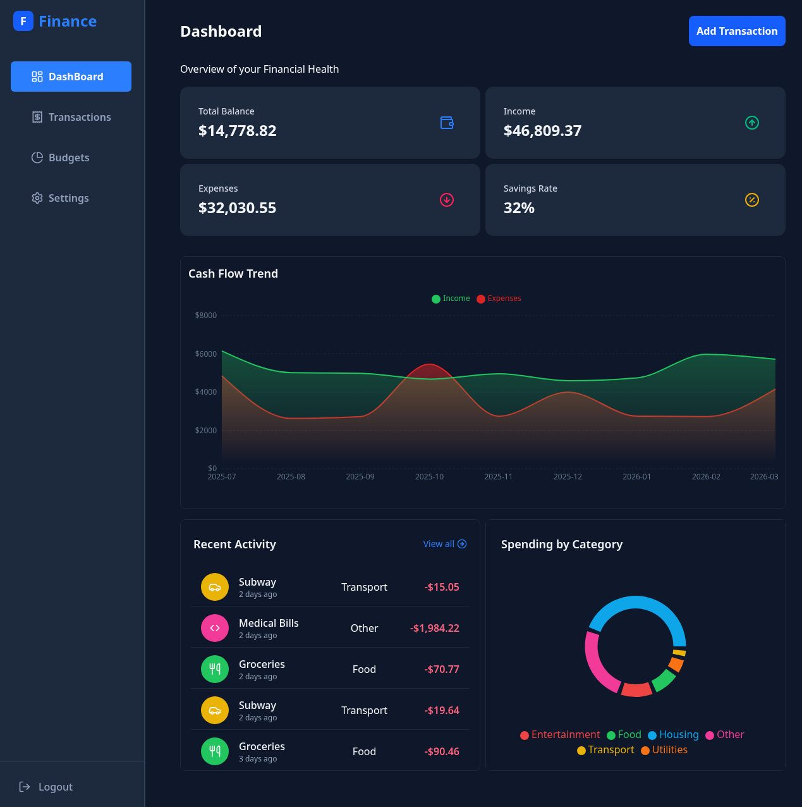
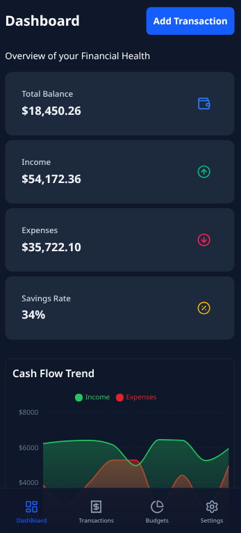
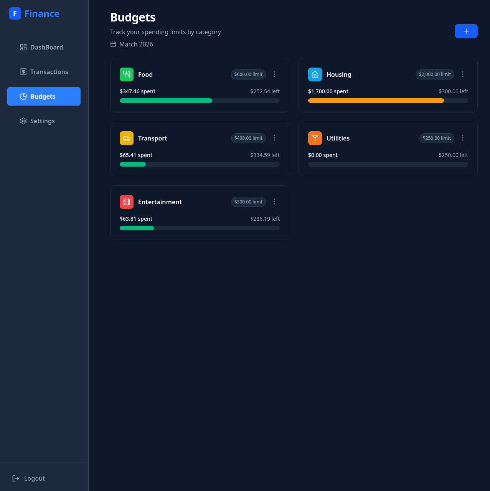
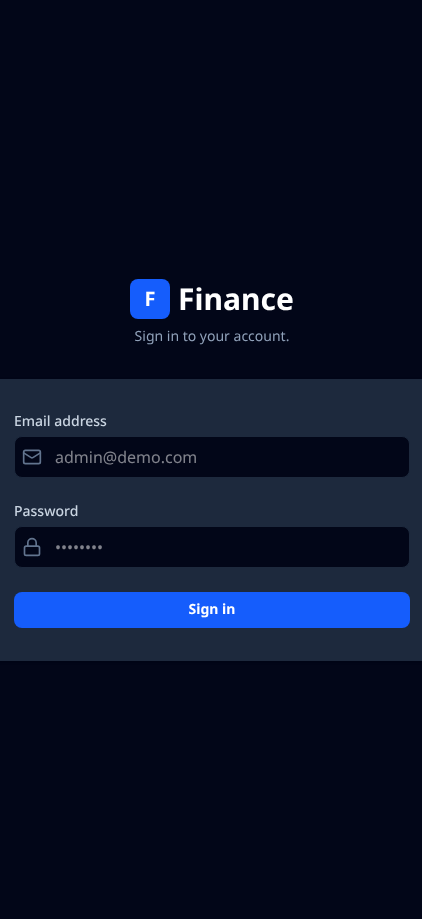

# Finance Dashboard 📊

**[Live version hosted on Vercel](https://finance-dashboard-five-indol.vercel.app/)**

This is a frontend web application for tracking personal finances, budgets, and transaction history. Primarily built to practice handling relational data on the client side, complex state management, and component architecture in a React environment.

## Features

- **Data Visualization:** Dynamic area and pie charts using Recharts.
- **Relational Budgeting:** Real-time calculation of transaction expenses against monthly category limits.
- **Secure Routing:** Protected routes and mock authentication flow using React Router's Data API.
- **Form Validation:** Strict schema validation using Zod and React Hook Form to ensure data integrity.
- **Global Notifications:** Custom built, self-clearing toast notification system.
- **Localization:** Dynamic currency formatting.

## Tech Stack

- **Core**: React, TypeScript, Vite
- **State Management**: Zustand
- **Routing**: React Router
- **Styling**: Tailwind CSS
- **Forms & Validation**: React Hook Form, Zod
- **Data Visualization**: Recharts

## Application Previews

|                 **Desktop Dashboard**                  |                        **Mobile View**                        |
| :----------------------------------------------------: | :-----------------------------------------------------------: |
|  |  |
|                     **Budgeting**                      |                        **Login Page**                         |
|    |       |

## Running Locally

1. Clone the repository  
   `git clone https://github.com/vilnout/finance-dashboard.git`
2. Run `npm install`
3. Run `npm run dev`
4. Go to `http://localhost:5173`

## Future Development

Currently this is an SPA running entirely on the client side with mock data generated on each refresh. It needs a backend api to handle real user authentication, session management and persistant database storage.
